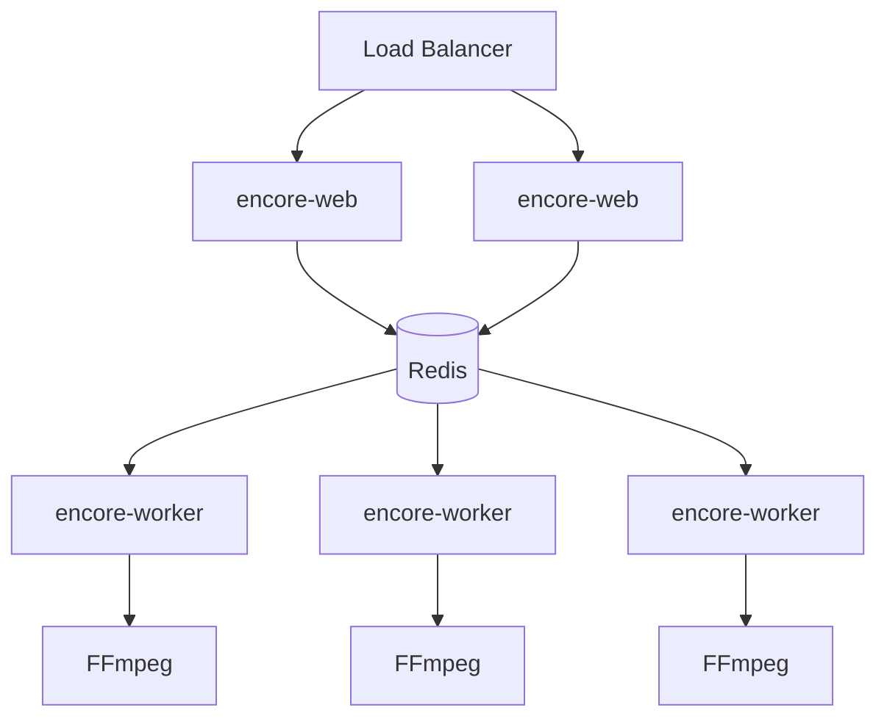
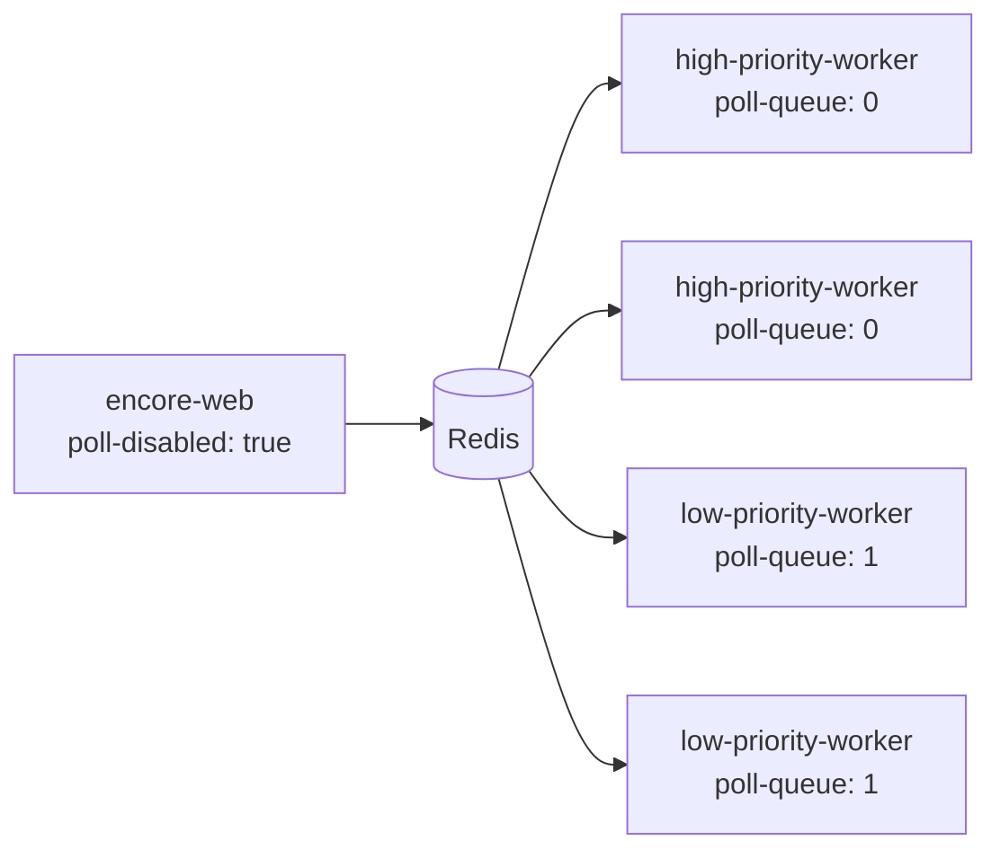

# Deployment

## Architecture

A production Encore deployment consists of three components:



- **encore-web** — the REST API. Can run behind a load balancer for high availability. Can optionally process jobs itself (polling is enabled by default).
- **encore-worker** — a headless worker that polls one job from the queue, transcodes it, and exits. Set `encore-settings.worker-drain-queue=true` to keep polling until the queue is empty. Scale horizontally by running multiple workers. See [Scaling with KEDA](#scaling-with-keda) for an example of autoscaling workers in Kubernetes.
- **Redis 8+** — job storage and queue. Requires the [JSON](https://redis.io/docs/latest/develop/data-types/json/) and [Search](https://redis.io/docs/latest/develop/interact/search-and-query/) modules. Should have persistence enabled for production.

<!-- prettier-ignore -->
!!! tip
    If all transcoding should be done by workers, set `encore-settings.poll-disabled=true` on encore-web so it only serves the API.

## Upgrading from v0.2.x to v1.0.0

v1.0.0 replaces Spring Data Redis with a direct Lettuce integration backed by the Redis JSON and Search modules. The Redis data model has changed, so **existing jobs and queues from a v0.2.x instance are not readable by v1.0.0** and may be lost if you upgrade in place.

Things to check before upgrading:

- **Redis version and modules.** v1.0.0 requires **Redis 8+** with the [JSON](https://redis.io/docs/latest/develop/data-types/json/) and [Search](https://redis.io/docs/latest/develop/interact/search-and-query/) modules enabled. May work with Valkey or other Redis-compatible servers, but this has not been tested. Managed Redis offerings may need to be reconfigured or replaced.
- **Audio codec defaults.** The `AudioEncode` / `SimpleAudioEncode` default codec changed from `libfdk_aac` to `aac` in v1.0.0. Profiles that still need `libfdk_aac` must set `codec: libfdk_aac` explicitly.
- **Redis connection config changed.** The `spring.data.redis.*` properties (host, port, password) are no longer used. Configure Redis via a single Lettuce URI and the `profile.location` property has moved:
  - Replace `spring.data.redis.host` / `spring.data.redis.port` with `encore-settings.redis.uri` (env: `ENCORE_SETTINGS_REDIS_URI`), e.g. `redis://redis.example.com:6379`
  - Replace `profile.location` with `encore-settings.profile.location` (env: `ENCORE_SETTINGS_PROFILE_LOCATION`)
  - See the [Lettuce URI syntax](https://redis.github.io/lettuce/user-guide/connecting-redis/#uri-syntax) for passwords and TLS.
- **Security configuration.** The `encore-settings.security.user-password` and `encore-settings.security.admin-password` properties have been replaced with a `users` map. See [Security](#security) for the new format.

Recommended upgrade path:

1. Stand up a Redis 8+ instance with the JSON and Search modules.
2. Deploy v1.0.0 alongside the existing v0.2.x instance, pointing it at the new Redis — or at the same server with a distinct `encore-settings.redis.prefix` so the two installations don't share keys.
3. Route newly submitted jobs to the v1.0.0 instance.
4. Let the v0.2.x instance finish its outstanding queue, then shut it down.

## Docker images

Pre-built Docker images are published to the GitHub Container Registry on each release:

| Image                       | Tags                 |
| --------------------------- | -------------------- |
| `ghcr.io/svt/encore-web`    | `latest`, `1.0.0`, … |
| `ghcr.io/svt/encore-worker` | `latest`, `1.0.0`, … |

These images bundle FFmpeg from [mwader/static-ffmpeg](https://github.com/wader/static-ffmpeg) and MediaInfo. They include `libx264`, `libx265`, `aac`, and most common codecs, but **not** `libfdk_aac`.

To build your own image with a custom FFmpeg (e.g. with `libfdk_aac`), Encore provides two Dockerfile variants in the `encore-web` and `encore-worker` modules:

- **Native image** (`Dockerfile`) — GraalVM AOT-compiled binary. Faster startup, lower memory usage.
- **JAR image** (`Dockerfile-jar`, encore-web only) — standard JVM. Requires Java 25+.

Both require a base image with **FFmpeg** and **MediaInfo** installed.

<!-- prettier-ignore -->
!!! note
    SVT uses an internal base image with FFmpeg compiled with the non-free codec `libfdk_aac`. Due to licensing restrictions, this image is not publicly available. If you need `libfdk_aac` or other non-free codecs, you need to build your own base image.

Build the images:

=== "Native image"

    ```bash
    # Build artifacts (requires GraalVM 25)
    ./gradlew build nativeCompile -x test

    # Build Docker images
    docker build --build-arg DOCKER_BASE_IMAGE=your-ffmpeg-base:latest \
      -t encore-web:latest encore-web/

    docker build --build-arg DOCKER_BASE_IMAGE=your-ffmpeg-base:latest \
      -t encore-worker:latest encore-worker/
    ```

=== "JAR image"

    ```bash
    # Build JARs
    ./gradlew build -x test

    # Build Docker image (encore-web)
    docker build --build-arg DOCKER_BASE_IMAGE=your-ffmpeg-jvm-base:latest \
      -f encore-web/Dockerfile-jar \
      -t encore-web:latest encore-web/
    ```

    The JAR base image must also include Java 25+.

Artifacts (JARs and native binaries) are also published to [GitHub Releases](https://github.com/svt/encore/releases) on each tagged release.

## Redis setup

Encore requires **Redis 8+** with the **JSON** and **Search** modules for job storage, queuing, and pub/sub messaging. Redis 8 (`redis:8.6-alpine`) includes these modules by default. May work with Valkey or other Redis-compatible servers that support these modules, but this has not been tested.

| Property                                | Default                  | Description                                                                                                          |
| --------------------------------------- | ------------------------ | -------------------------------------------------------------------------------------------------------------------- |
| `encore-settings.redis.uri`             | `redis://localhost:6379` | Redis connection URI ([Lettuce URI format](https://redis.github.io/lettuce/user-guide/connecting-redis/#uri-syntax)) |
| `encore-settings.redis.prefix`          | `encore`                 | Key prefix for all Redis keys                                                                                        |
| `encore-settings.redis.job-expire-time` | `7d`                     | TTL for completed jobs                                                                                               |

The `prefix` is applied consistently to all Redis keys, making it safe to run multiple Encore instances against the same Redis by giving each a unique prefix.

Example URIs:

```
redis://localhost:6379
redis://password@redis.example.com:6379
rediss://password@redis.example.com:6380
redis-sentinel://password@sentinel1:26379,sentinel2:26379/mymaster
```

## Scaling workers

### Why priority queues?

Transcoding jobs can run for many hours, and hardware is always finite. Without prioritisation, a small number of long-running low-priority jobs could occupy every available worker, forcing urgent jobs to wait for hours. Priority queues solve this by isolating job classes so that **low-priority transcodes can never block high-priority ones** — each priority class has its own queue and its own pool of workers.

### How concurrency is wired up

The `encore-settings.concurrency` setting defines **how many priority queues exist in Redis**. Each queue represents a priority _class_, and a job is routed to a queue based on its priority when it is submitted. Each queue is itself a priority queue — jobs within a queue are pulled in priority order, so a higher-priority job in a given class is always picked up before a lower-priority one in the same class.

How that concurrency value is consumed depends on the component:

- **`encore-worker` always uses a single thread** and polls a single queue. Pin each worker to a specific queue via `encore-settings.poll-queue`. To increase throughput for a priority class, run more workers pinned to that queue.
- **`encore-web` with polling enabled** starts one thread per queue (= `concurrency` threads in total) so a single web instance can serve every priority class by itself. For production deployments, prefer running `encore-web` with `poll-disabled: true` and dedicating `encore-worker` pods to each priority class.

Within each thread, jobs are processed one at a time — a thread is blocked for the full duration of its current transcode.

The right value for `concurrency` depends entirely on how many priority classes your workload needs. There is no universally correct default: pick the number of priority classes required to keep urgent work unblocked by routine work, and size each worker pool independently from there.

### Example deployment

The examples below use `concurrency: 2` — one high-priority queue and one low-priority queue — with dedicated workers for each class. This is intentionally minimal to keep the example readable; real deployments commonly use more classes.



Each worker pool scales independently: if a long low-priority job occupies every low-priority worker, the high-priority workers remain free and continue picking up urgent work.

### Priority-to-queue mapping

Job priorities range from `0` (default, lowest) to `100` (highest). The priority determines which queue a job lands in; within that queue, jobs are still ordered by priority so finer-grained ranking is preserved.

With `concurrency: 2` the mapping between job priority and queue is:

| Job priority | Queue | Role          |
| ------------ | ----- | ------------- |
| 50–100       | 0     | High priority |
| 0–49         | 1     | Low priority  |

Queue `0` always holds the highest-priority class; queue `concurrency - 1` always holds the lowest.

### `poll-higher-prio`

The `poll-higher-prio` flag decides whether a thread pinned to a lower-priority queue may pick up jobs from higher-priority queues.

- `poll-higher-prio: true` (default) — higher-priority queues are **always polled before** the assigned queue. This lets lower-priority threads assist with higher-priority workloads whenever higher-priority jobs are waiting.
- `poll-higher-prio: false` — the thread only polls its assigned queue.

**Recommended setting for `encore-worker` is `false`**, so each worker pool stays strictly within its priority class. Either setting preserves the core guarantee that low-priority jobs can never be picked up ahead of high-priority jobs.

### Configuration reference

| Property                             | Default | Description                                                                                        |
| ------------------------------------ | ------- | -------------------------------------------------------------------------------------------------- |
| `encore-settings.concurrency`        | `2`     | Number of priority queues. Also the number of polling threads in `encore-web`.                     |
| `encore-settings.poll-queue`         | _(all)_ | Pin instance to a specific queue number. Required on `encore-worker` to select its priority class. |
| `encore-settings.poll-higher-prio`   | `true`  | Poll higher-priority queues before the assigned queue                                              |
| `encore-settings.poll-disabled`      | `false` | Disable polling entirely (API-only mode for `encore-web`)                                          |
| `encore-settings.poll-delay`         | `5s`    | Interval between queue polls                                                                       |
| `encore-settings.poll-initial-delay` | `10s`   | Delay after startup before first poll                                                              |
| `encore-settings.worker-drain-queue` | `false` | Keep polling until queue is empty before exiting (`encore-worker`)                                 |

<!-- prettier-ignore -->
!!! note
    Every instance sharing a Redis should use the same `concurrency` value, because it defines the set of queues that exist. If you need to change it, existing jobs are migrated to the new queue layout on the next startup.

## Segmented transcoding

For large files, Encore can split the input into segments and transcode them in parallel across multiple workers.

To enable segmented transcoding:

1. Set `encore-settings.shared-work-dir` to a directory accessible by all Encore instances (e.g., NFS mount)
2. Submit a job with `segmentLength` set (in seconds, should be a multiple of the target GOP)

| Property                                   | Default  | Description                                                             |
| ------------------------------------------ | -------- | ----------------------------------------------------------------------- |
| `encore-settings.shared-work-dir`          | _(none)_ | Shared directory for segment files. Required for segmented transcoding. |
| `encore-settings.segmented-encode-timeout` | `120m`   | Timeout for a segmented transcode before failing                        |

<!-- prettier-ignore -->
!!! warning
    Thumbnails and VMAF quality metrics are not supported in segmented transcoding mode.

## Security

Encore supports optional HTTP basic authentication. When enabled, users are configured as a named map — there are no fixed account names.

| Property                                         | Default      | Description                                                                         |
| ------------------------------------------------ | ------------ | ----------------------------------------------------------------------------------- |
| `encore-settings.security.enabled`               | `false`      | Enable authentication                                                               |
| `encore-settings.security.users.<name>.password` | _(required)_ | Password — plain text or Spring Security encoder prefix (e.g. `{bcrypt}$2a$10$...`) |
| `encore-settings.security.users.<name>.role`     | `USER`       | `USER` or `ADMIN`                                                                   |

Roles:

- **USER** — read jobs, access Swagger UI
- **ADMIN** — create and cancel jobs, plus everything USER can do (`ADMIN` implies `USER`)

Swagger UI (`/swagger-ui/**`) is always accessible without authentication even when security is enabled — authentication is required only when making API calls from the UI.

Actuator endpoints are always accessible without authentication (see [Health and Actuator endpoints](#health-and-actuator-endpoints)).

```yaml
encore-settings:
  security:
    enabled: true
    users:
      ops-user:
        password: "${OPS_PASSWORD}"
        role: USER
      ci-admin:
        password: "${CI_ADMIN_PASSWORD}"
        role: ADMIN
```

## Health and Actuator endpoints

Spring Boot Actuator exposes health and management endpoints, reachable without authentication even when [security](#security) is enabled:

| Endpoint                     | Purpose                    |
| ---------------------------- | -------------------------- |
| `/actuator/health`           | Overall health status      |
| `/actuator/health/liveness`  | Kubernetes liveness probe  |
| `/actuator/health/readiness` | Kubernetes readiness probe |

Detailed health info (`status` field breakdown per component) is only shown to authenticated `admin` users; anonymous callers get the top-level status only.

## Local temporary transcoding

By default, Encore writes output files directly to the `outputFolder`. If output storage is slow or unstable (e.g., network-mounted storage), you can enable local temporary transcoding:

```yaml
encore-settings:
  local-temporary-encode: true
```

When enabled, Encore transcodes to a local temporary directory first and copies the finished files to the output folder afterwards. This avoids FFmpeg stalling on slow writes during transcoding.

## Scaling with KEDA

While Encore is platform-agnostic, it works well with [KEDA](https://keda.sh/) (Kubernetes Event-Driven Autoscaling) for autoscaling workers based on queue depth.

The following example creates a KEDA `ScaledJob` that monitors the Redis queue and spins up worker pods as jobs arrive:

```yaml
apiVersion: keda.sh/v1alpha1
kind: ScaledJob
metadata:
  name: encore-worker-high-prio
spec:
  successfulJobsHistoryLimit: 1
  failedJobsHistoryLimit: 1
  jobTargetRef:
    ttlSecondsAfterFinished: 3600
    activeDeadlineSeconds: 864000
    backoffLimit: 0
    parallelism: 1
    template:
      metadata:
        labels:
          app: encore-worker-high-prio
          app.kubernetes.io/name: encore-worker
          app.kubernetes.io/instance: high-prio-job
      spec:
        topologySpreadConstraints:
          - labelSelector:
              matchLabels:
                app.kubernetes.io/name: encore-worker
            maxSkew: 1
            topologyKey: kubernetes.io/hostname
            whenUnsatisfiable: ScheduleAnyway
        containers:
          - image: your-encore-worker-image:latest
            name: encore-worker
            env:
              - name: SPRING_APPLICATION_NAME
                value: encore
              - name: ENCORE_SETTINGS_REDIS_URI
                value: redis://redis:6379
              - name: ENCORE_SETTINGS_PROFILE_LOCATION
                value: file:/profiles/profiles.yml
              - name: ENCORE_SETTINGS_POLL_QUEUE
                value: "0"
              - name: ENCORE_SETTINGS_POLL_HIGHER_PRIO
                value: "false"
              - name: ENCORE_TMPDIR
                value: /scratch
            resources:
              requests:
                cpu: 10
                memory: 10Gi
              limits:
                memory: 40Gi
            volumeMounts:
              - name: storage
                mountPath: /storage
              - name: scratch-volume
                mountPath: /scratch
        volumes:
          - name: storage
            persistentVolumeClaim:
              claimName: encore-storage
          - name: scratch-volume
            ephemeral:
              volumeClaimTemplate:
                spec:
                  accessModes: ["ReadWriteOnce"]
                  resources:
                    requests:
                      storage: 40Gi
        restartPolicy: Never
  maxReplicaCount: 50
  pollingInterval: 10
  scalingStrategy:
    strategy: accurate
  rollout:
    strategy: gradual
  triggers:
    - type: redis
      metadata:
        address: redis:6379
        listName: encore:queue:0
        listLength: "1"
        activationListLength: "0"
```

Key points:

- **`ENCORE_SETTINGS_POLL_QUEUE`** pins the worker to a specific queue (here queue `0`, the highest priority). Create multiple `ScaledJob` resources for different priority queues.
- **`ENCORE_TMPDIR`** points to the scratch volume for temporary transcoding files.
- **`listName`** matches the Redis key pattern `{prefix}:queue:{queueNumber}`. The prefix defaults to the `spring.application.name`.
- **`maxReplicaCount`** limits the number of concurrent worker pods.
- **Ephemeral volumes** provide fast local scratch storage for each worker pod.
- KEDA monitors the Redis sorted set and scales workers up when jobs are queued, and scales to zero when idle.

## Logging

Encore uses JSON-structured logging via Logback. Logs are formatted for integration with log aggregation tools (ELK, Loki, etc.).

Each job can include a `logContext` map of key-value pairs that are added to the MDC (Mapped Diagnostic Context) for all log entries related to that job, making it easy to filter and correlate logs.

## Configuration

Encore is configured via standard Spring Boot mechanisms — `application.yml`, environment variables, or command-line arguments. See the [Configuration Reference](configuration.md) for all available properties.

### Shared configuration with per-role overrides

The recommended way to configure a deployment is to **share a single `application.yml` across `encore-web` and every `encore-worker`**, and override only the settings that differ per role using environment variables. Keeping the bulk of the configuration identical across instances avoids drift between the API and the workers, and means the Redis URI, profile location, `concurrency`, encoding defaults and security settings only need to be changed in one place.

A typical split looks like this:

**Shared `application.yml`** — mounted into every instance:

```yaml
encore-settings:
  concurrency: 2
  encoding:
    # …shared encoding defaults
  redis:
    uri: redis://redis:6379
  profile:
    location: file:/profiles/profiles.yml
```

**`encore-web`** — API only, no polling:

```
ENCORE_SETTINGS_POLL_DISABLED=true
```

**High-priority worker:**

```
ENCORE_SETTINGS_POLL_QUEUE=0
ENCORE_SETTINGS_POLL_HIGHER_PRIO=false
```

**Low-priority worker:**

```
ENCORE_SETTINGS_POLL_QUEUE=1
ENCORE_SETTINGS_POLL_HIGHER_PRIO=false
```

All properties support Spring Boot's [relaxed binding](https://docs.spring.io/spring-boot/reference/features/external-config.html#features.external-config.typesafe-configuration-properties.relaxed-binding), so any YAML property can be overridden with an equivalently-named environment variable.
