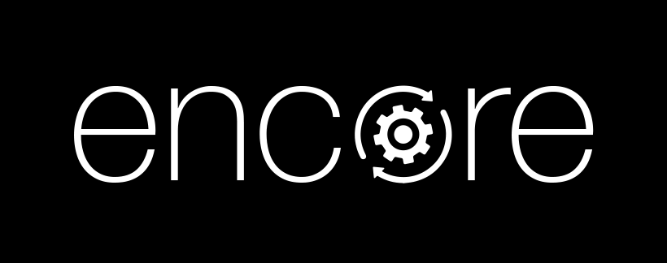
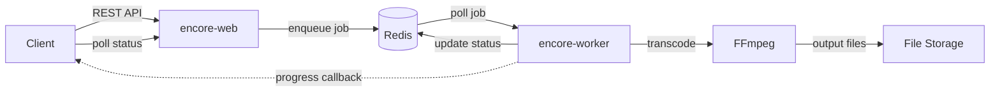

# SVT Encore

**Scalable video transcoding as a service, built on FFmpeg and Spring Boot.**

Encore is an open-source transcoding tool created by [SVT](https://www.svt.se) (Sveriges Television) to scale and abstract the transcoding power of FFmpeg, offering a simple REST API for transcoding — Transcoding-as-a-Service. Encore has been in production at SVT since 2019 and was open sourced in 2021.

Encore is aimed at the advanced technical user that needs a scalable video transcoding tool — for example, as a part of a VOD (Video On Demand) transcoding pipeline.

## Key features

- **Scalable** — separate web API and worker components, Redis-backed job queues, configurable concurrency
- **Profile-driven transcoding** — YAML-based transcoding profiles with support for dynamic parameters via SpEL expressions
- **Codec support** — H.264 (x264), H.265 (x265), any FFmpeg-supported codec via generic video encode, plus audio codecs (AAC, AC-3, etc.)
- **Thumbnail generation** — single thumbnails and thumbnail map sprite sheets
- **Quality metrics** — VMAF quality measurement
- **Progress callbacks** — HTTP callbacks for job progress monitoring
- **Segmented transcoding** — parallel chunk-based transcoding for faster processing
- **Security** — optional basic authentication with user and admin roles
- **OpenAPI** — built-in Swagger UI for API exploration

## Design philosophy

Encore is designed as a **standalone component** intended to operate within a larger automated system. Rather than being an all-in-one transcoding suite, Encore focuses on doing one thing well — executing transcoding jobs reliably and at scale. These principles guide its design:

- **Automation-first** — Encore is built primarily to work inside automated workflows and does not feature a UI. Job feedback is handled through progress callbacks, making it straightforward to integrate into end-to-end transcoding pipelines.
- **Priority queues** — Jobs are managed through priority queues, allowing urgent work to be processed ahead of lower-priority tasks.
- **Minimal dependencies** — Redis is the only external dependency beyond FFmpeg. Using a single data store for job storage, queuing, and pub/sub keeps deployment simple and makes it easy to scale horizontally.
- **FFmpeg command-line builder** — Rather than reimplementing FFmpeg's vast parameter space, Encore constructs FFmpeg command lines directly. This gives full access to FFmpeg's flexibility without Encore needing to wrap every option.

## Architecture

Encore consists of two services that communicate via Redis:

- **encore-web** — the REST API service. Accepts transcoding jobs, serves the Swagger UI, and optionally processes jobs itself.
- **encore-worker** — a headless worker that polls Redis for jobs and runs FFmpeg to transcode them. Scale horizontally by running multiple workers.
- **Redis** — stores job data and acts as the job queue. Used for pub/sub (cancellation, segmented transcoding progress).
- **FFmpeg** — the transcoding engine. Must be installed on all machines running encore-web (if polling is enabled) or encore-worker.

## What Encore is not

- Not a live/stream transcoder
- Not a video packager (use a tool like [Shaka Packager](https://github.com/shaka-project/shaka-packager) for that)
- Not a GUI application

## Built with

- [Kotlin](https://kotlinlang.org/)
- [Spring Boot](https://spring.io/projects/spring-boot)
- [FFmpeg](https://www.ffmpeg.org/)
- [Redis](https://redis.io/) (via [Lettuce](https://redis.github.io/lettuce/))
- [GraalVM](https://www.graalvm.org/) (native image compilation)

## License

Encore is licensed under the [EUPL-1.2-or-later](https://eupl.eu/) license.

Copyright 2020–2026 Sveriges Television AB.
